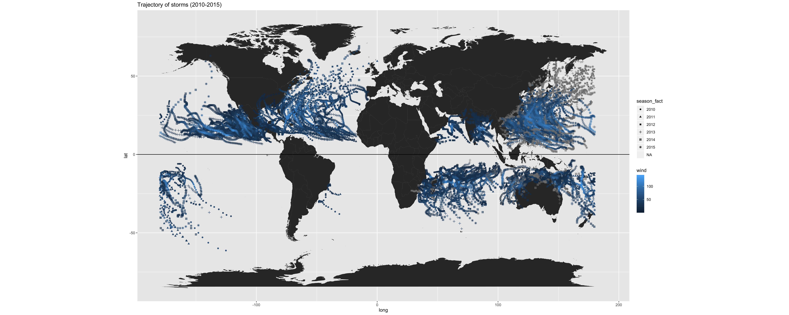
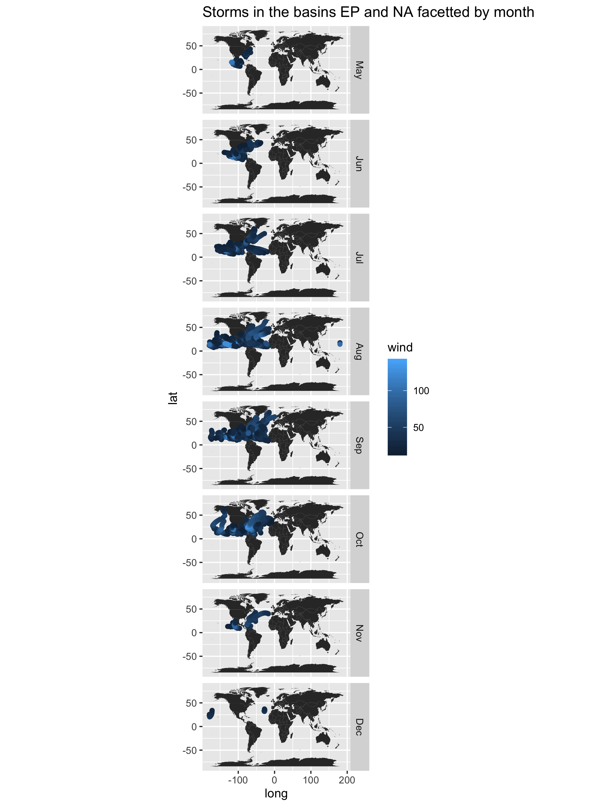
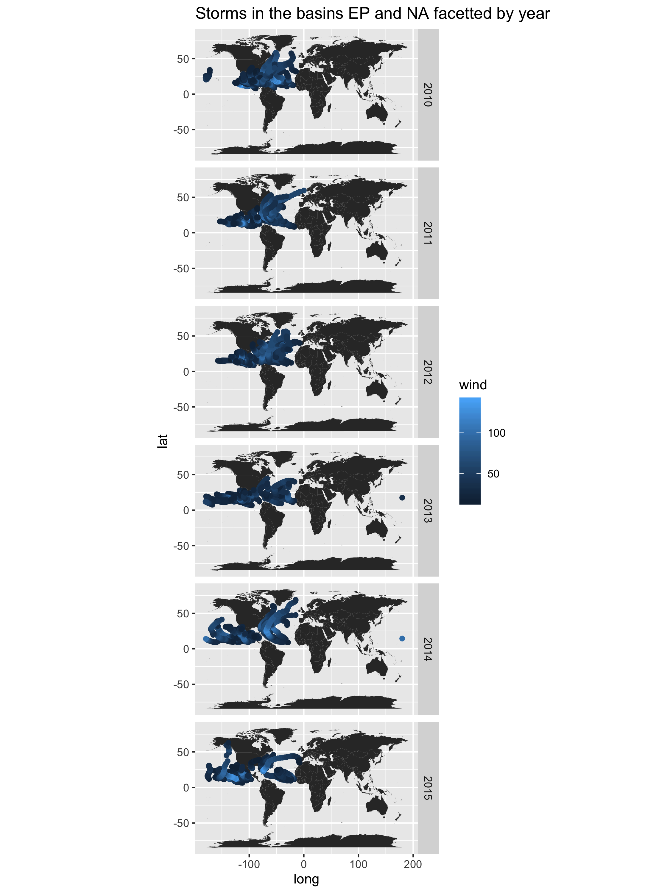

storms-taisei-tateno.Rmd
================

``` r
library(readr)
library(ggplot2)
library(dplyr)
library(lubridate)
```

``` r
aspect_ratio <- 2.5
col_names <- c("serial_num", 
               "season", 
               "num", 
               "basin", 
               "sub_basin", 
               "name", 
               "iso_time", 
               "nature", 
               "latitude", 
               "longitude", 
               "wind", 
               "press")
col_types <- cols(col_character(), 
                  col_integer(), 
                  col_character(), 
                  col_factor(), 
                  col_character(), 
                  col_character(), 
                  col_character(), 
                  col_character(), 
                  col_double(), 
                  col_double(), 
                  col_double(), 
                  col_double())
```

``` r
dat <- read_csv("../data/ibtracs-2010-2015.csv", 
         col_names = col_names, 
         col_types = col_types,
         na = c("-999.", "-1.0", "0.0"))
dat <- dat%>%tail(-2)
dat <- dat%>%mutate(season_fact = factor(season))
dat <- dat%>%mutate(date_time = ymd_hms(iso_time))
dat <- dat%>%mutate(month_num = month(date_time))
dat <- dat%>%mutate(month_str = month(date_time, label = TRUE))
dat%>%head(5)
```

    ## # A tibble: 5 x 16
    ##   serial_num season num   basin sub_basin name  iso_time nature latitude
    ##   <chr>       <int> <chr> <fct> <chr>     <chr> <chr>    <chr>     <dbl>
    ## 1 2009317S1…   2010 01    SI    MM        ANJA  2009-11… TS         -9.5
    ## 2 2009317S1…   2010 01    SI    MM        ANJA  2009-11… TS        -10.2
    ## 3 2009317S1…   2010 01    SI    MM        ANJA  2009-11… TS        -11.1
    ## 4 2009317S1…   2010 01    SI    MM        ANJA  2009-11… TS        -11.9
    ## 5 2009317S1…   2010 01    SI    MM        ANJA  2009-11… TS        -12.5
    ## # … with 7 more variables: longitude <dbl>, wind <dbl>, press <dbl>,
    ## #   season_fact <fct>, date_time <dttm>, month_num <dbl>, month_str <ord>

``` r
We begin by providing some general summary statistics for every column of the dat table. 
This enables us to gain a basic understanding of the types of values we will be working with.
```

``` r
dat%>%summary()
```

    ##   serial_num            season         num                basin     
    ##  Length:19481       Min.   :2010   Length:19481       WP     :5755  
    ##  Class :character   1st Qu.:2011   Class :character   SI     :4132  
    ##  Mode  :character   Median :2013   Mode  :character   EP     :3314  
    ##                     Mean   :2013                      NA     :2838  
    ##                     3rd Qu.:2014                      SP     :2040  
    ##                     Max.   :2015                      NI     :1353  
    ##                                                       (Other):  49  
    ##   sub_basin             name             iso_time        
    ##  Length:19481       Length:19481       Length:19481      
    ##  Class :character   Class :character   Class :character  
    ##  Mode  :character   Mode  :character   Mode  :character  
    ##                                                          
    ##                                                          
    ##                                                          
    ##                                                          
    ##     nature             latitude         longitude            wind      
    ##  Length:19481       Min.   :-61.300   Min.   :-179.90   Min.   :  3.0  
    ##  Class :character   1st Qu.:-12.800   1st Qu.: -76.10   1st Qu.: 30.0  
    ##  Mode  :character   Median : 15.200   Median :  80.80   Median : 40.0  
    ##                     Mean   :  9.086   Mean   :  36.09   Mean   : 46.7  
    ##                     3rd Qu.: 22.800   3rd Qu.: 129.60   3rd Qu.: 60.0  
    ##                     Max.   : 69.000   Max.   : 180.00   Max.   :140.0  
    ##                     NA's   :1675      NA's   :1675      NA's   :4143   
    ##      press        season_fact   date_time                  
    ##  Min.   : 885.0   2010:2787   Min.   :2009-11-13 06:00:00  
    ##  1st Qu.: 984.0   2011:3255   1st Qu.:2011-08-26 12:00:00  
    ##  Median : 996.0   2012:3307   Median :2013-01-14 18:00:00  
    ##  Mean   : 989.8   2013:3299   Mean   :2013-01-19 14:00:06  
    ##  3rd Qu.:1004.0   2014:3537   3rd Qu.:2014-07-28 00:00:00  
    ##  Max.   :1017.0   2015:3296   Max.   :2015-10-15 00:00:00  
    ##  NA's   :2297                                              
    ##    month_num        month_str   
    ##  Min.   : 1.000   Aug    :2879  
    ##  1st Qu.: 4.000   Sep    :2871  
    ##  Median : 8.000   Oct    :2340  
    ##  Mean   : 6.902   Jul    :1807  
    ##  3rd Qu.: 9.000   Jan    :1650  
    ##  Max.   :12.000   Feb    :1530  
    ##                   (Other):6404

<p>

We would like to know the frequency of storms for every season between
2010 - 2015. We explore this inquiry in the following code chunk:

</p>

<h4>

What is the number of (unique) storms in each year?

</h4>

``` r
season_storm_count <- dat%>%
  group_by(season)%>%
  summarize(storm_frequency = n_distinct(serial_num))
season_storm_count
```

    ## # A tibble: 6 x 2
    ##   season storm_frequency
    ##    <int>           <int>
    ## 1   2010              88
    ## 2   2011              96
    ## 3   2012              91
    ## 4   2013             103
    ## 5   2014              94
    ## 6   2015              90

<p>

While this is informative, we plot this data in the form of a line plot
to improve its
readability

</p>

``` r
ggplot(season_storm_count, aes(x = season, y = storm_frequency)) + geom_line() + ggtitle("Line plot of storm frequencies overtime (2010 - 2015)")
```

<!-- -->

``` r
ggsave("../images/line-plot-of-storm-frequencies-overtime.pdf", height = 10, width = 10 * aspect_ratio)
ggsave("../images/line-plot-of-storm-frequencies-overtime.png", height = 10, width = 10 * aspect_ratio)
```

<p>

It is clear that 2013 had an unusually high number of storms in
comparison to the other years

</p>

<p>

Next, we’d like to find the total number of distinct storms from 2010 -
2015. This is accomplished through the following
query:

</p>

``` r
total_unique_storms <- season_storm_count%>%summarize(total_unique_storms=sum(storm_frequency))
total_unique_storms
```

    ## # A tibble: 1 x 1
    ##   total_unique_storms
    ##                 <int>
    ## 1                 562

<p>

There are 562 distinct storm entries from 2010 - 2015. This is
interesting it isn’t very useful. We can get more granular and ask
ourselves the following questions:

</p>

<h4>

What is the total number of storms per hemisphere?

</h4>

<h4>

Do storms tend to occur more often in one hemisphere than in the other?

</h4>

``` r
northern_storms <- dat%>%
  group_by(serial_num)%>%
  summarize(median_latitude=max(latitude))%>%
  filter(median_latitude > 0)%>%
  nrow()

southern_storms <- dat%>%
  group_by(serial_num)%>%
  summarize(median_latitude=min(latitude))%>%
  filter(median_latitude < 0)%>%
  nrow()

northern_storms 
```

    ## [1] 270

``` r
southern_storms
```

    ## [1] 62

<p>

From 2010 - 2015, the frequenecy of storms in the Northern hemisphere
(270) was greater in comparison to the frequency of storms in the
Southern hemisphere (62).

</p>

<p>

We’d like to know whether there exists any storms whose trajectories
pass the equator. We use the following code chunk to answer this
question:

</p>

``` r
equator_storms <- dat%>%
  group_by(serial_num)%>%
  summarize(max_latitude = max(latitude), min_latitude = min(latitude))%>%
  filter((max_latitude > 0) & (min_latitude < 0))
equator_storms
```

    ## # A tibble: 0 x 3
    ## # … with 3 variables: serial_num <chr>, max_latitude <dbl>,
    ## #   min_latitude <dbl>

<p>

It appears that there are no storms whose trajectory passes the equator.
We verify the validity of this observation in the following
visualization:

</p>

<p>

We map the trajectories for all storms from seasons between 2010 - 2015.
We use a color scale to determine how the wind speed of each storm
changes as the trajectory of the storm
changes.

</p>

``` r
knitr::include_graphics(('../images/map-all-storms.png'))
```



<p>

It is clear that there are no storms whose trajectories pass the
equator. We observe that the wind speeds of storms in the Northern
Indian and Southern Pacific basins are lower than those of the Eastern
Pacific, Northern Atlantic, and the Eastern Pacific basin.

</p>

<p>

Next we’d like to understand which month of the year has the greatest
frequency of storms. We accomplish this with the following query:

</p>

``` r
dat%>%
  group_by(serial_num)%>%
  summarise(month_str = first(month_str))%>%
  group_by(month_str)%>%
  summarize(counts = n())%>%
  filter(counts == max(counts))
```

    ## # A tibble: 1 x 2
    ##   month_str counts
    ##   <ord>      <int>
    ## 1 Aug           84

<p>

We find that August possesses the greatest storm frequency from the
years 2010 - 2015 with a count of 84. This begs the question, how does
storm frequency vary from month to month? We answer the question in the
following code chunk:

</p>

<h4>

Do storms tend to occur uniformly throughout the year (evenly amount of
storms per month)? Or are there months where there’s more storm
activity?

</h4>

``` r
storms_by_month <- dat%>%  
  group_by(serial_num)%>%
  summarise(month_str = first(month_str))%>%
  group_by(month_str)%>%
  count()
storms_by_month
```

    ## # A tibble: 12 x 2
    ## # Groups:   month_str [12]
    ##    month_str     n
    ##    <ord>     <int>
    ##  1 Jan          48
    ##  2 Feb          35
    ##  3 Mar          30
    ##  4 Apr          20
    ##  5 May          27
    ##  6 Jun          46
    ##  7 Jul          61
    ##  8 Aug          84
    ##  9 Sep          83
    ## 10 Oct          65
    ## 11 Nov          27
    ## 12 Dec          36

<p>

We use the following barplot to improve the readability of our findings
from above:

</p>

``` r
storms_by_month_plt <- ggplot(storms_by_month, aes(month_str, n)) + 
  geom_bar(stat = "identity") + 
  xlab('month') + 
  ylab('frequency') + 
  ggtitle('storm frequency by month from 2010 - 2015')
storms_by_month_plt
```

<!-- -->

``` r
ggsave("../images/storm-frequency-by-month.pdf", height = 10, width = 10 * aspect_ratio)
ggsave("../images/storm-frequency-by-month.png", height = 10, width = 10 * aspect_ratio)
```

<p>

From the visualization above, it is clear that storm frequency increases
throughout Spring and Summer and decreases throughout Fall and Winter.
Storms tend to occur most frequently between the months of July and
October.

</p>

<h4>

Is there a particular Basin where storms occur more frequently? Or are
there basins without much storm activity?

</h4>

``` r
dat%>%
  group_by(serial_num)%>%
  summarize(basin=first(basin))%>%
  group_by(basin)%>%
  count()%>%
  arrange(-n)
```

    ## # A tibble: 7 x 2
    ## # Groups:   basin [7]
    ##   basin     n
    ##   <fct> <int>
    ## 1 WP      160
    ## 2 EP      108
    ## 3 SI       95
    ## 4 NA       94
    ## 5 SP       55
    ## 6 NI       48
    ## 7 SA        2

<p>

We’re interested in seeing how the wind speed of storms vary for each
month of the year for storms that are categorized under basins EP and
NA. We create the following visulation to learn
more:

</p>

``` r
knitr::include_graphics(('../images/map-ep-na-storms-by-month.png'))
```



<p>

The facetted plot reaffirms the observations made in the barplot above.
There is an increase in storm frequency throughout Spring and Summer a
decrease in frequency throughout Fall and Winter. Storms tend to occur
most frequently between the months of July and October. One advantage of
the facetted plot relative to the barplot is we can observe changes in
windspeed relative to the trajectory of each storm.

</p>

<p>

Taking a less granular approach to this inquiry, we want to determine
how the wind speed of storms vary for every year between 2010 - 2015 for
storms that are categorized under basins EP and NA. We create the
following visulation to learn
more:

</p>

``` r
knitr::include_graphics(('../images/map-ep-na-storms-by-year.png'))
```



<p>

Notice the variance in windspeeds for each year. It appears that there
is a positive association between the variables.

</p>

<h4>

What is the typical duration of a storm (e.g. in terms of hours, or
days)?

</h4>

<h4>

Are there storms with durations that deviate considerably from the
typical duration?

</h4>

``` r
storm_duration <- dat%>%
  group_by(serial_num)%>%
  summarize(max_time = max(iso_time), min_time = min(iso_time))%>%
  mutate(diff_time = difftime(max_time, min_time))
storm_duration%>%head(5)
```

    ## # A tibble: 5 x 4
    ##   serial_num    max_time            min_time            diff_time
    ##   <chr>         <chr>               <chr>               <drtn>   
    ## 1 2009317S10073 2009-11-20 00:00:00 2009-11-13 06:00:00 162 hours
    ## 2 2009325S12066 2009-11-26 12:00:00 2009-11-20 12:00:00 144 hours
    ## 3 2009337S07096 2009-12-17 06:00:00 2009-12-03 00:00:00 342 hours
    ## 4 2009342S09140 2009-12-23 18:00:00 2009-12-08 00:00:00 378 hours
    ## 5 2009346S07086 2009-12-31 06:00:00 2009-12-12 00:00:00 462 hours

``` r
storm_duration%>%summary()
```

    ##   serial_num          max_time           min_time        
    ##  Length:562         Length:562         Length:562        
    ##  Class :character   Class :character   Class :character  
    ##  Mode  :character   Mode  :character   Mode  :character  
    ##   diff_time       
    ##  Length:562       
    ##  Class :difftime  
    ##  Mode  :numeric

<p>

The average storm duration is approximately 185 hours. We see that there
was a storm whose duration was 642 hours, which deviates considerably
from the typical duration.

</p>

<p>

Next we want to find the 10 storms with the longest duration in hours.
We use the following code chunk to examine this more carefully:

</p>

``` r
top_storm_duration <- storm_duration%>%
  mutate(diff_time = as.numeric(diff_time))%>%
  arrange(desc(diff_time))
top_storm_duration%>%head(10)
```

    ## # A tibble: 10 x 4
    ##    serial_num    max_time            min_time            diff_time
    ##    <chr>         <chr>               <chr>                   <dbl>
    ##  1 2015229N08212 2015-09-13 00:00:00 2015-08-17 06:00:00       642
    ##  2 2012255N16322 2012-10-04 06:00:00 2012-09-10 12:00:00       570
    ##  3 2014065S10139 2014-03-28 18:00:00 2014-03-06 00:00:00       545
    ##  4 2014204N10239 2014-08-14 06:00:00 2014-07-22 18:00:00       540
    ##  5 2011192N18158 2011-07-31 00:00:00 2011-07-10 18:00:00       486
    ##  6 2011208N09145 2011-08-15 12:00:00 2011-07-26 12:00:00       480
    ##  7 2013305N07141 2013-11-21 00:00:00 2013-11-01 06:00:00       475
    ##  8 2015188N07193 2015-07-26 12:00:00 2015-07-06 18:00:00       474
    ##  9 2009346S07086 2009-12-31 06:00:00 2009-12-12 00:00:00       462
    ## 10 2012279N15145 2012-10-23 18:00:00 2012-10-05 00:00:00       450

<p>

We use a histogram to visualize the distribution of storm durations for
years between 2010 - 2015

</p>

``` r
ggplot(storm_duration, aes(diff_time)) + 
  geom_histogram(binwidth = 30) + 
  ggtitle("histogram of storm durations")
```

<!-- -->

``` r
ggsave("../images/histogram-of-storm durations.pdf", height = 10, width = 10 * aspect_ratio)
ggsave("../images/histogram-of-storm durations.png", height = 10, width = 10 * aspect_ratio)
```

<p>

The histogram of storm durations for storms between 2010 - 2015 is
skewed to the right.

</p>

<h4>

What is the top-10 list of storms in terms of high wind speed values?

</h4>

<p>

Before addressing this inquiry, we use the summary function to
understand the maximum windspeed of each storm

</p>

``` r
high_winds <- dat%>%
  group_by(serial_num)%>%
  summarize(max_wind = max(wind))
high_winds%>%summary()
```

    ##   serial_num           max_wind    
    ##  Length:562         Min.   :  4.0  
    ##  Class :character   1st Qu.: 45.0  
    ##  Mode  :character   Median : 57.0  
    ##                     Mean   : 66.6  
    ##                     3rd Qu.: 87.5  
    ##                     Max.   :140.0  
    ##                     NA's   :319

``` r
top_high_winds <- high_winds%>%arrange(-max_wind)
top_high_winds
```

    ## # A tibble: 562 x 2
    ##    serial_num    max_wind
    ##    <chr>            <dbl>
    ##  1 2010169N13266      140
    ##  2 2014234N12261      140
    ##  3 2010251N14337      135
    ##  4 2011199N10271      135
    ##  5 2014142N10254      135
    ##  6 2015238N10255      135
    ##  7 2015270N27291      135
    ##  8 2014160N15259      130
    ##  9 2010236N12341      125
    ## 10 2011264N13264      125
    ## # … with 552 more rows

<p>

We see that 10 storms with the highest windspeeds had windspeeds that
ranged from 125 mph to 140 mph

</p>
